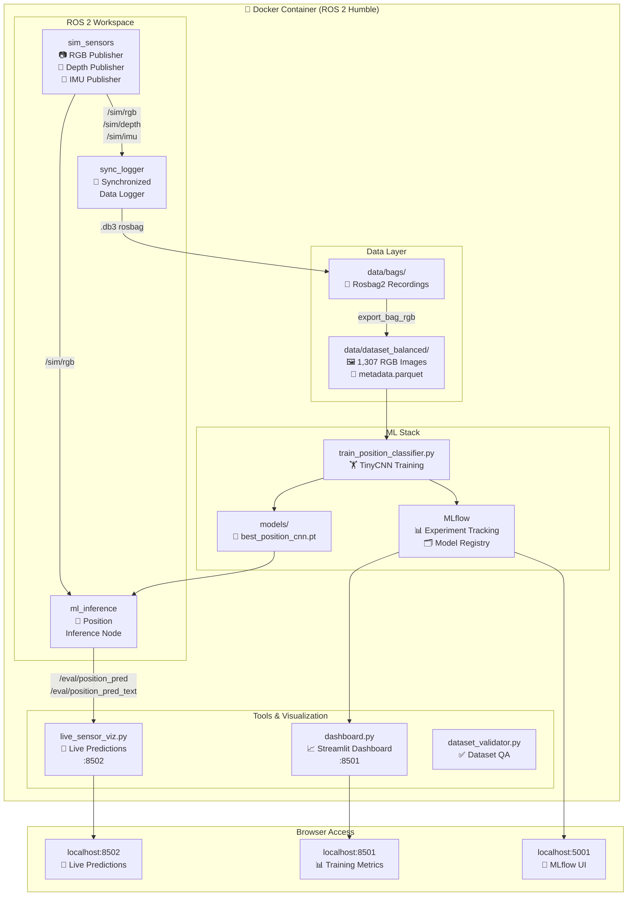
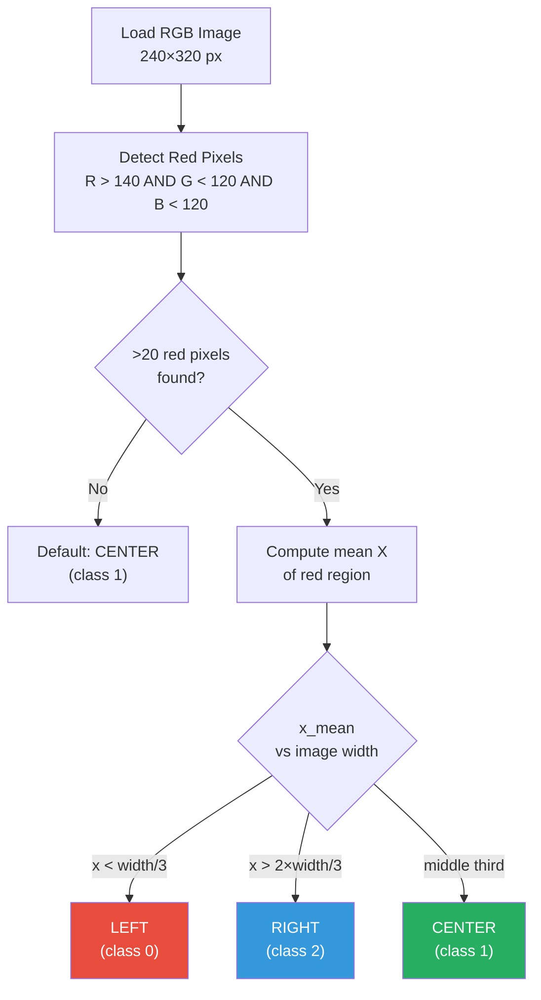
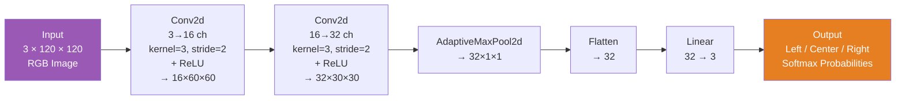
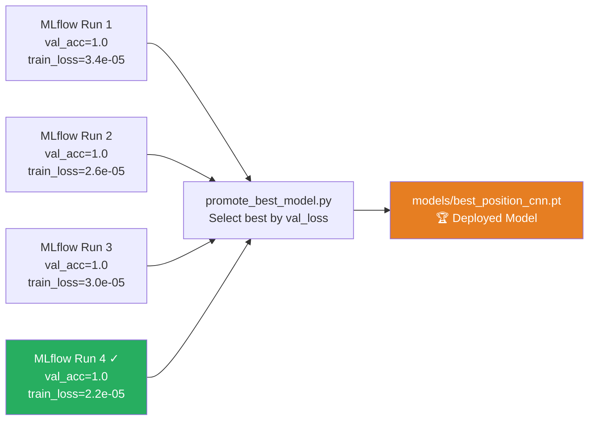
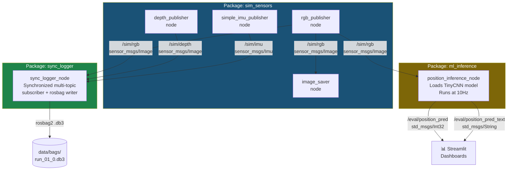
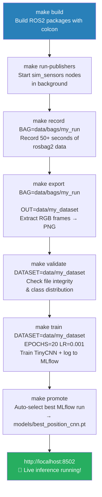

# 🤖 Robotics ML Pipeline

> An end-to-end machine learning pipeline for real-time robot position classification using simulated ROS 2 sensor data, PyTorch, and MLflow.

---

## 📋 Table of Contents

- [Overview](#overview)
- [System Architecture](#system-architecture)
- [Data Pipeline](#data-pipeline)
- [ML Model](#ml-model)
- [ROS 2 Node Graph](#ros-2-node-graph)
- [Project Structure](#project-structure)
- [Quick Start](#quick-start)
- [Step-by-Step Usage](#step-by-step-usage)
- [Results](#results)
- [Tech Stack](#tech-stack)

---

## Overview

This project demonstrates a **complete robotics ML pipeline**: from simulated sensors generating raw data, through dataset creation and CNN training, to live real-time inference running inside a ROS 2 node — all tracked with MLflow and visualized via Streamlit dashboards.

The task: classify the **horizontal position** (Left / Center / Right) of a red box in a simulated camera feed using a lightweight CNN trained on rosbag recordings.

### What it looks like

The simulated camera generates synthetic RGB scenes with three geometric objects (red box, green circle, blue triangle) that cycle through Left → Center → Right positions at 10Hz:

| Left | Center | Right |
|------|--------|-------|
| Red box in left third | Red box in center third | Red box in right third |

The CNN learns to classify which third of the frame the **red box** occupies, achieving **100% validation accuracy** on this task.

---

## System Architecture



---

## Data Pipeline

```mermaid
flowchart LR
    A["🤖 sim_sensors\nROS 2 Node\n10Hz RGB + Depth + IMU"] 
    -->|"ROS Topics"| B

    B["sync_logger\nSynchronized subscriber\nTimestamp alignment"]
    -->|"rosbag2 .db3"| C

    C["data/bags/run_01/\nRosbag Recording\n~30 seconds"]
    -->|"make export"| D

    D["export_bag_rgb_to_dataset.py\nExtract RGB frames\nConvert to PNG"]
    -->|"1,307 images +\nmetadata.parquet"| E

    E["data/dataset_balanced/\nBalanced Dataset\nLeft / Center / Right"]
    -->|"make validate"| F

    F["dataset_validator.py\nFile integrity check\nClass distribution check"]
    -->|"✅ Pass"| G

    G["train_position_classifier.py\nTinyCNN Training\n80/20 train/val split"]
    -->|"metrics + weights"| H

    H["MLflow\nExperiment Tracking\nConfusion Matrix"]
    -->|"promote_best_model.py"| I

    I["models/best_position_cnn.pt\n✨ Best Model\nVal Acc = 100%"]

    style A fill:#4a90d9,color:#fff
    style E fill:#27ae60,color:#fff
    style I fill:#e67e22,color:#fff
    style F fill:#16a085,color:#fff
```



### Auto-labeling Logic

The dataset uses **automatic label generation** — no manual annotation needed. During training, each image is analyzed on-the-fly:



---

## ML Model

### TinyCNN Architecture



### Training Results

| Metric | Value |
|--------|-------|
| Final Train Accuracy | **100%** |
| Final Val Accuracy | **100%** |
| Final Val Loss | **1.56e-05** |
| Epochs | 5 |
| Learning Rate | 0.001 |
| Batch Size | 16 |
| Dataset Size | 1,307 images |
| Train / Val Split | 1,045 / 262 |

### MLflow Experiment Tracking

All training runs are tracked with MLflow, including hyperparameters, metrics per epoch, and model artifacts. The `promote_best_model.py` script automatically selects the best run and saves it to `models/best_position_cnn.pt`.



---

## ROS 2 Node Graph



---

## Project Structure

```
robotics-ml-pipeline/
├── 🐳 docker/
│   ├── Dockerfile              # ROS 2 Humble + Python ML stack
│   └── docker-compose.yml      # dev + mlflow services
│
├── 🤖 ros2_ws/src/
│   ├── sim_sensors/            # Simulated sensor publishers
│   │   ├── rgb_pub.py          # RGB camera (240×320, 10Hz)
│   │   ├── depth_pub.py        # Depth map publisher
│   │   ├── simple_pub.py       # IMU publisher
│   │   └── image_saver.py      # Save frames to disk
│   ├── ml_inference/
│   │   └── position_inference_node.py  # Live CNN inference
│   └── sync_logger/
│       └── sync_logger_node.py # Synchronized rosbag writer
│
├── 🧠 ml/
│   ├── train_position_classifier.py    # TinyCNN training + MLflow
│   ├── eval_confusion_matrix.py        # Standalone evaluation
│   └── artifacts/
│       ├── position_cnn.pt             # Latest trained weights
│       ├── confusion_matrix.txt        # Evaluation results
│       └── training_info.json          # Run metadata
│
├── 🛠️ tools/
│   ├── export_bag_rgb_to_dataset.py    # Rosbag → PNG dataset
│   ├── dataset_validator.py            # Dataset integrity checks
│   ├── dataset_utils.py                # Shared utilities
│   ├── promote_best_model.py           # MLflow → model registry
│   ├── dashboard.py                    # Streamlit metrics dashboard
│   └── live_sensor_viz.py             # Streamlit live inference view
│
├── 📦 models/
│   ├── best_position_cnn.pt            # ✨ Active production model
│   └── registry.json                   # Model promotion history
│
├── 📁 data/
│   ├── bags/                           # Rosbag2 recordings (.db3)
│   └── dataset_balanced/               # Exported training dataset
│       ├── images/                     # 1,307 RGB PNGs (240×320)
│       ├── metadata.parquet            # Image metadata + timestamps
│       └── dataset_info.json           # Dataset provenance
│
├── 📜 scripts/
│   └── record_rosbag.sh               # Rosbag recording script
│
└── Makefile                            # Full pipeline orchestration
```

---

## Quick Start

### Fastest Way: One Command

```bash
docker compose -f docker/docker-compose.yml up -d dev mlflow
docker compose -f docker/docker-compose.yml exec dev bash
cd /workspace && make full-pipeline
```

Then open: **http://localhost:8502** to see live predictions!

`make full-pipeline` does everything automatically:
1. Builds ROS 2 packages
2. Starts sensor simulation
3. Records 30 seconds of rosbag data
4. Exports to a dataset
5. Trains the model (5 epochs)
6. Promotes the best model

### View Results

| URL | What you see |
|-----|-------------|
| http://localhost:8502 | Live predictions + video feed |
| http://localhost:8501 | Training metrics dashboard |
| http://localhost:5001 | MLflow experiment details |

### Reset Everything

```bash
# Kill all processes
docker compose -f docker/docker-compose.yml exec dev bash -c "pkill -9 -f 'ros2|streamlit|python3' || true"

# Remove containers
docker compose -f docker/docker-compose.yml down

# Start fresh
docker compose -f docker/docker-compose.yml up -d dev mlflow
docker compose -f docker/docker-compose.yml exec dev bash
cd /workspace && make full-pipeline
```

---

## Step-by-Step Usage



### Key `make` Targets

| Command | Description |
|---------|-------------|
| `make full-pipeline` | Run the complete pipeline end-to-end |
| `make build` | Build all ROS 2 packages |
| `make run-publishers` | Start simulated sensor nodes |
| `make record BAG=<path>` | Record rosbag (50+ seconds recommended) |
| `make export BAG=<path> OUT=<path>` | Export rosbag to image dataset |
| `make validate DATASET=<path>` | Validate dataset integrity |
| `make train DATASET=<path> EPOCHS=<n> LR=<lr>` | Train and log to MLflow |
| `make promote` | Promote best MLflow run to model registry |
| `make eval` | Run evaluation and save confusion matrix |

---

## Results

### Model Performance

The TinyCNN achieves perfect classification on this simulated dataset after just 5 epochs of training:

```
Confusion Matrix
================================================
Labels: Left (0), Center (1), Right (2)

Predicted → |  Left  | Center |  Right |
------------|--------|--------|--------|
Left        |   262  |    0   |    0   |
Center      |     0  |  262   |    0   |
Right       |     0  |    0   |  262   |

Precision / Recall / F1: 1.000 across all classes
```

### Multiple Training Runs (MLflow Registry)

| Run | Val Accuracy | Val Loss | Train Loss |
|-----|-------------|----------|------------|
| Run 1 | 100% | 2.85e-05 | 3.41e-05 |
| Run 2 | 100% | 2.12e-05 | 2.60e-05 |
| Run 3 | 100% | 2.41e-05 | 2.95e-05 |
| **Run 4 ✓** | **100%** | **1.56e-05** | **2.17e-05** |

---

## Tech Stack

| Layer | Technology |
|-------|-----------|
| **Robotics Middleware** | ROS 2 Humble |
| **Deep Learning** | PyTorch (TinyCNN) |
| **Experiment Tracking** | MLflow |
| **Data Format** | Rosbag2 (.db3), Parquet, PNG |
| **Visualization** | Streamlit, Plotly |
| **Containerization** | Docker + Docker Compose |
| **Language** | Python 3.10 |

### Requirements

- Docker and Docker Compose
- 4GB+ RAM recommended
- macOS / Linux (ARM64 compatible)

---

## Extending This Project

This serves as a template for robotics ML pipelines. Key areas for extension:

- **More sensor modalities**: Add LiDAR, GPS, thermal camera topics
- **Different architectures**: ResNet, MobileNet, Vision Transformers
- **Real hardware**: Swap `sim_sensors` for a real camera ROS 2 driver
- **Simulation environments**: Gazebo, Isaac Sim, Webots
- **More complex tasks**: Object detection, depth estimation, navigation
- **CI/CD**: Automated retraining on new rosbag data

---

## License

MIT License — feel free to use this as a starting point for your robotics ML projects.
