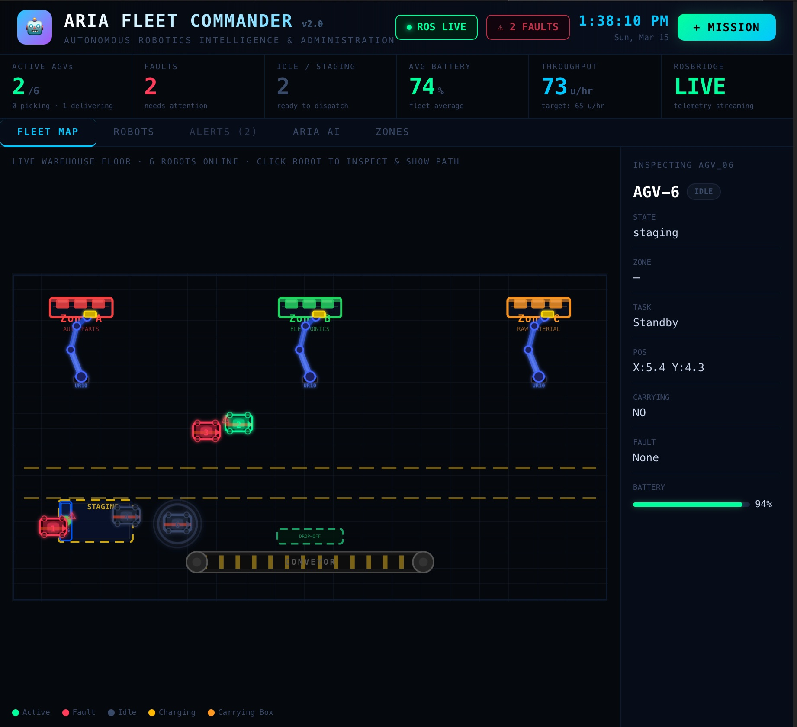
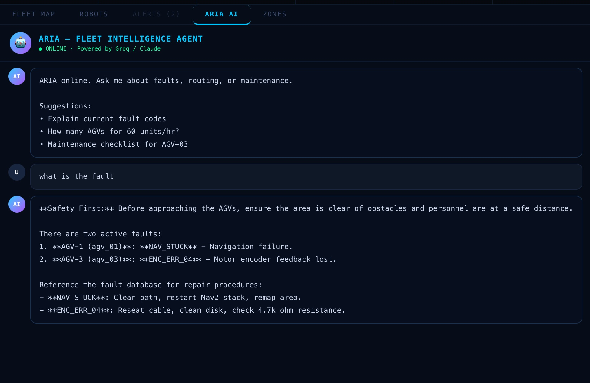
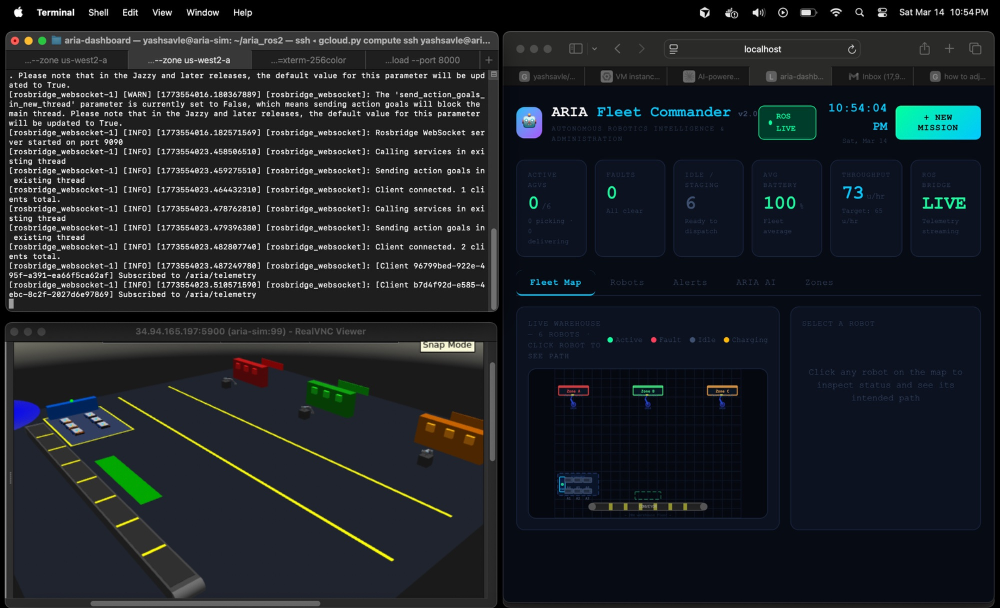
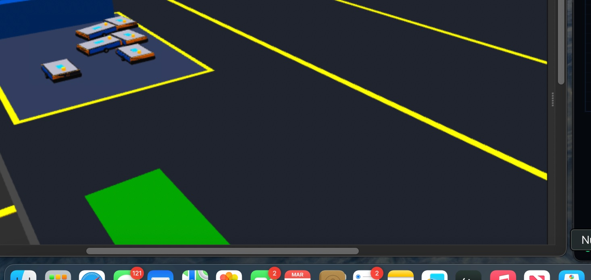

# ARIA Fleet Commander

**Autonomous Robotics Intelligence & Administration**


A warehouse AGV fleet management system I built to explore how ROS2, simulation, and LLMs can work together in an industrial robotics context. The system runs 6 custom AGV robots in a Gazebo simulation and streams live telemetry to a React dashboard via WebSocket. An AI agent powered by Claude handles fault diagnosis and fleet optimization queries.

---

## Demo



*Fleet map showing active AGVs with fault alerts, real-time battery monitoring, and robot inspector panel.*



*Claude-powered AI agent identifying active faults and providing step-by-step repair procedures.*



*Custom warehouse world in Gazebo Classic 11 — 3 pick zones with UR10 manipulators, conveyor belt, and AGV staging area.*



*6 custom flat-platform AGV models in the staging area.*

---

## What it does

The system has three layers that communicate continuously:

**Simulation (GCP VM)** — Gazebo runs the physics simulation with 6 custom AGV robots and a warehouse environment. Each robot is a differential drive platform with odometry. Three pick zones have UR10 manipulator arms as loading stations. A conveyor belt on the south wall is the drop-off point.

**Fleet Manager (ROS2 node)** — A Python ROS2 node manages all 6 AGVs. It handles mission assignment, waypoint navigation, battery simulation, and fault injection. Each AGV follows its own lane to avoid collisions. The node broadcasts full fleet telemetry every 2 seconds over `/aria/telemetry`.

**Dashboard + Backend (Mac/local)** — A React frontend connects directly to the ROS2 WebSocket bridge and shows live robot positions, states, and battery levels. A FastAPI backend handles mission dispatch and serves the Claude AI endpoint.

---

## Architecture

```
Mac (local)
├── React Dashboard (Vite)       ← connects via WebSocket to rosbridge
│   └── http://localhost:5173
└── FastAPI Backend              ← forwards missions to ROS2
    └── http://localhost:8000
          │
          │ WebSocket (port 9090)
          ▼
GCP VM (Ubuntu 22.04, e2-standard-4)
├── rosbridge_server             ← WebSocket bridge to ROS2
├── ARIA Fleet Manager           ← ROS2 node, manages all 6 AGVs
│   ├── /aria/telemetry          ← fleet state broadcast
│   ├── /aria/mission            ← receives dispatch commands
│   ├── /aria/inject_fault       ← fault simulation
│   └── /agv_XX/cmd_vel + odom   ← per-robot control + feedback
└── Gazebo Classic 11            ← physics simulation
    └── 6x custom AGV models + warehouse world
```

---

## Key features

**Mission dispatch with throughput calculation** — specify material type, hourly target, and destination dock. The system auto-maps material type to pick zone (auto parts → Zone A, electronics → Zone B, raw material → Zone C) and calculates AGV count based on a 15 units/AGV/hour throughput model.

**Real-time position sync** — AGV positions on the dashboard map come directly from `/agv_XX/odom` topics published by Gazebo. The SVG warehouse map is coordinate-mapped to match the actual Gazebo world layout.

**Fault injection and AI diagnosis** — faults can be injected on specific AGVs via a ROS2 topic. When a fault appears, the Claude agent explains the fault code, provides repair steps, and assesses fleet impact with full context of current fleet state.

**Lane-based collision avoidance** — each AGV is assigned a fixed X-axis lane so dispatched robots travel in parallel without blocking each other.

**Battery simulation** — active AGVs drain at 0.04%/sec. Below 15%, they auto-route to the charging station and stop accepting new missions until fully charged.

---

## Tech stack

| Layer | Technology | Purpose |
|---|---|---|
| Robot simulation | Gazebo Classic 11 | Physics simulation, sensor emulation |
| Robot middleware | ROS2 Humble (Python) | Robot communication, navigation |
| WebSocket bridge | rosbridge_server | Streams ROS2 topics to browser |
| Backend API | FastAPI + Python 3.10 | Mission dispatch, AI proxy |
| AI agent | Anthropic Claude (claude-sonnet-4) | Fault diagnosis, optimization |
| Frontend | React 18 + Vite | Real-time dashboard |
| Styling | Inline CSS + SVG | Custom warehouse map |
| Cloud | GCP e2-standard-4 (Ubuntu 22.04) | VM hosting the simulation |
| Remote display | Xvfb + x11vnc | Headless Gazebo GUI over VNC |
| AGV model | Custom SDF (diff drive) | Flat warehouse AGV, no sensors |
| Manipulators | UR10 URDF (static) | Pick station visualization |

---

## ROS2 topics

| Topic | Message type | Purpose |
|---|---|---|
| `/aria/telemetry` | `std_msgs/String` | Full fleet JSON, published every 2s |
| `/aria/mission` | `std_msgs/String` | Mission dispatch from dashboard |
| `/aria/inject_fault` | `std_msgs/String` | Fault simulation trigger |
| `/agv_XX/cmd_vel` | `geometry_msgs/Twist` | Velocity commands per robot |
| `/agv_XX/odom` | `nav_msgs/Odometry` | Real position feedback from Gazebo |

---

## Repository structure

```
aria-fleet-commander/
├── aria-dashboard/
│   └── src/App.jsx              # React dashboard — map, KPIs, mission modal, AI chat
├── aria-backend/
│   ├── app/main.py              # FastAPI routes + rosbridge mission publisher
│   └── app/agents/aria_agent.py # Claude AI agent with fault database
├── aria-ros2/
│   └── src/aria_fleet/
│       ├── aria_fleet/
│       │   └── fleet_manager.py # ROS2 node — navigation, dispatch, fault handling
│       └── launch/
│           └── warehouse_sim.launch.py
├── worlds/
│   └── aria_warehouse_v2.world  # Gazebo world — zones, conveyor, staging area
└── docs/
    └── STARTUP_COMMANDS.sh      # Full startup reference
```

---

## Setup

### Prerequisites

- Mac with Node.js 18+, Python 3.10+
- GCP VM running Ubuntu 22.04 (e2-standard-4)
- ROS2 Humble + Gazebo Classic 11 on the VM
- Anthropic API key

### 1. Clone

```bash
git clone https://github.com/yashsavle/aria-fleet-commander.git
cd aria-fleet-commander
```

### 2. Dashboard

```bash
cd aria-dashboard
npm install
```

Create `.env`:
```
VITE_API_URL=http://localhost:8000
VITE_WS_URL=ws://YOUR_VM_IP:9090
```

### 3. Backend

```bash
cd aria-backend
pip3 install fastapi uvicorn anthropic websockets python-dotenv
```

Create `.env`:
```
ANTHROPIC_API_KEY=your_key_here
```

### 4. VM — build the ROS2 package

```bash
gcloud compute ssh your-user@aria-sim --zone your-zone

cd ~/aria_ros2
colcon build --symlink-install
source install/setup.bash
```

### 5. VM — firewall rules

```bash
gcloud compute firewall-rules create aria-ports \
  --allow tcp:9090,tcp:5900 \
  --source-ranges 0.0.0.0/0
```

---

## Running

### VM

```bash
Xvfb :99 -screen 0 1280x800x24 &
x11vnc -display :99 -nopw -listen 0.0.0.0 -xkb -forever &

export DISPLAY=:99
export LIBGL_ALWAYS_SOFTWARE=1
export GAZEBO_MODEL_PATH=~/aria_agv_model:/opt/ros/humble/share/turtlebot3_gazebo/models
source /opt/ros/humble/setup.bash
source ~/aria_ros2/install/setup.bash

gzserver --verbose ~/aria_warehouse_v2.world \
  -s libgazebo_ros_init.so -s libgazebo_ros_factory.so &
sleep 15
gzclient --verbose &
```

In a new SSH tab:
```bash
source /opt/ros/humble/setup.bash
source ~/aria_ros2/install/setup.bash
ros2 launch aria_fleet warehouse_sim.launch.py
```

### Mac

```bash
# Terminal 1
cd aria-backend && python3 -m uvicorn app.main:app --reload --port 8000

# Terminal 2
cd aria-dashboard && npm run dev
```

Open `http://localhost:5173` — confirm ROS LIVE is green.

---

## Usage

**Dispatch a mission** — click + MISSION, enter material type and hourly target. The system picks the right zone and calculates robot count automatically.

**Monitor fleet** — Fleet Map tab shows live positions. Click any robot to see its state, zone, battery, and intended path.

**Inject a fault** — for testing:
```bash
ros2 topic pub --once /aria/inject_fault std_msgs/msg/String '{"data": "agv_01,agv_03"}'
```

**Ask the AI** — ARIA AI tab, ask about fault codes, maintenance, or throughput optimization.

---

## Notes

- VM IP changes on restart — update `VITE_WS_URL` in `.env` and `ros_ws_url` in `main.py`
- Stop the VM between sessions: `gcloud compute instances stop aria-sim`
- `colcon build --symlink-install` means edits to `fleet_manager.py` apply without rebuilding

---

## What's next

There's a lot of room to grow this into a more complete warehouse management system. Some directions I'm thinking about:

**Navigation and path planning** — right now AGVs follow fixed waypoints per lane. A proper implementation would use Nav2 with dynamic global and local planners, so robots can replan around obstacles in real time. Adding a path planning management panel to the dashboard would let operators visualize and override routes manually.

**Manipulator robot management** — the UR10 arms are currently static. Integrating MoveIt2 would enable actual pick-and-place trajectories. The dashboard could show arm state, gripper status, and cycle times per zone, with the ability to pause or reassign a manipulator remotely.

**Over-the-air updates** — a mechanism to push fleet manager configuration, waypoint maps, or even firmware updates to the AGV fleet without physically accessing each robot. Could be built on top of a ROS2 parameter server or a dedicated update service.

**Fleet scheduling and optimization** — instead of simple throughput-based dispatch, implement a proper scheduler that accounts for AGV battery levels, current positions, zone queue depth, and dock availability. An LLM-assisted optimizer could suggest shift configurations based on historical throughput data.

**Traffic management** — a centralized traffic controller that assigns right-of-way at intersections, manages convoy spacing, and prevents deadlocks when multiple AGVs need to cross the same point.

**Digital twin sync** — keep the Gazebo simulation synchronized with a real deployment, so operators can test mission plans in simulation before pushing to physical robots.

**Multi-warehouse support** — extend the architecture to manage fleets across multiple warehouse locations from a single dashboard, with per-site telemetry aggregation and cross-site analytics.

**Maintenance scheduling** — track AGV runtime hours, motor cycles, and battery charge counts. Surface predictive maintenance alerts before failures occur, integrated with the existing fault management system.

---

## Author

Yash Savle

---

## License

MIT License

Copyright (c) 2026 Yash Savle

Permission is hereby granted, free of charge, to any person obtaining a copy of this software and associated documentation files (the "Software"), to deal in the Software without restriction, including without limitation the rights to use, copy, modify, merge, publish, distribute, sublicense, and/or sell copies of the Software, and to permit persons to whom the Software is furnished to do so, subject to the following conditions:

The above copyright notice and this permission notice shall be included in all copies or substantial portions of the Software.

THE SOFTWARE IS PROVIDED "AS IS", WITHOUT WARRANTY OF ANY KIND, EXPRESS OR IMPLIED, INCLUDING BUT NOT LIMITED TO THE WARRANTIES OF MERCHANTABILITY, FITNESS FOR A PARTICULAR PURPOSE AND NONINFRINGEMENT. IN NO EVENT SHALL THE AUTHORS OR COPYRIGHT HOLDERS BE LIABLE FOR ANY CLAIM, DAMAGES OR OTHER LIABILITY, WHETHER IN AN ACTION OF CONTRACT, TORT OR OTHERWISE, ARISING FROM, OUT OF OR IN CONNECTION WITH THE SOFTWARE OR THE USE OR OTHER DEALINGS IN THE SOFTWARE.
